# Assignment 2: Divergent Design

## 1. Audience and value
**App Name**: Glimpses

**Audience**: Frequent social media users who wish to have more control in how they explore new content.

**Value**: 
- On top of basic sharing features, it focuses on the experience of content discovery.
- Easy tools to break out of algorithm built eco-chambers.
- Make users more balanced, better educated, better informed, and more responsbile for their online habits by giving them the tools to do so.

## 2. Comparables

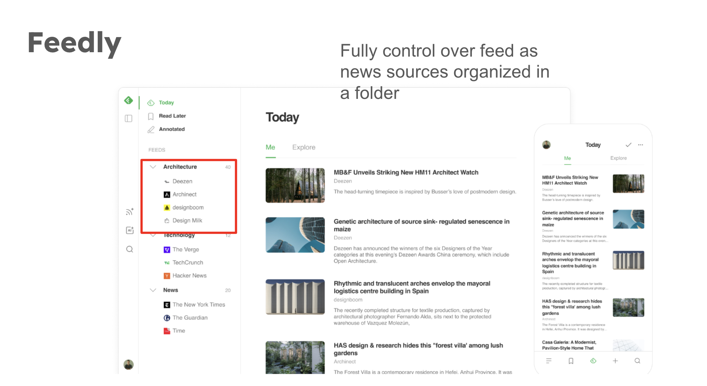

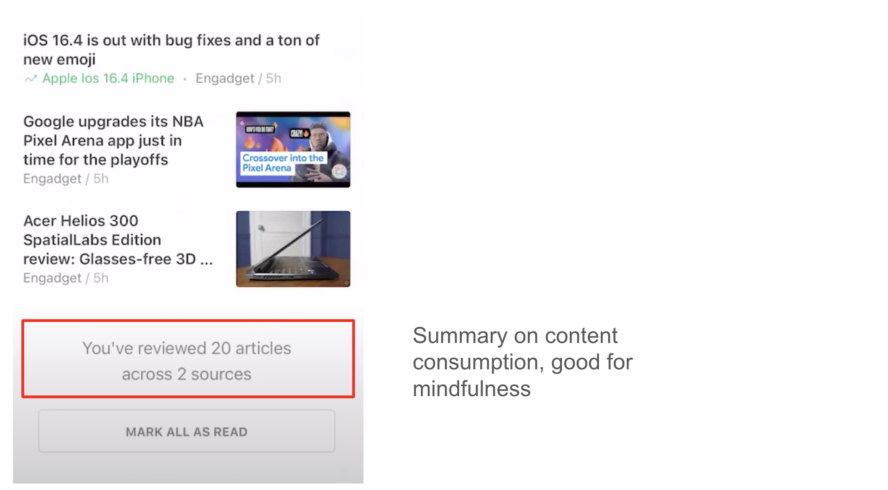

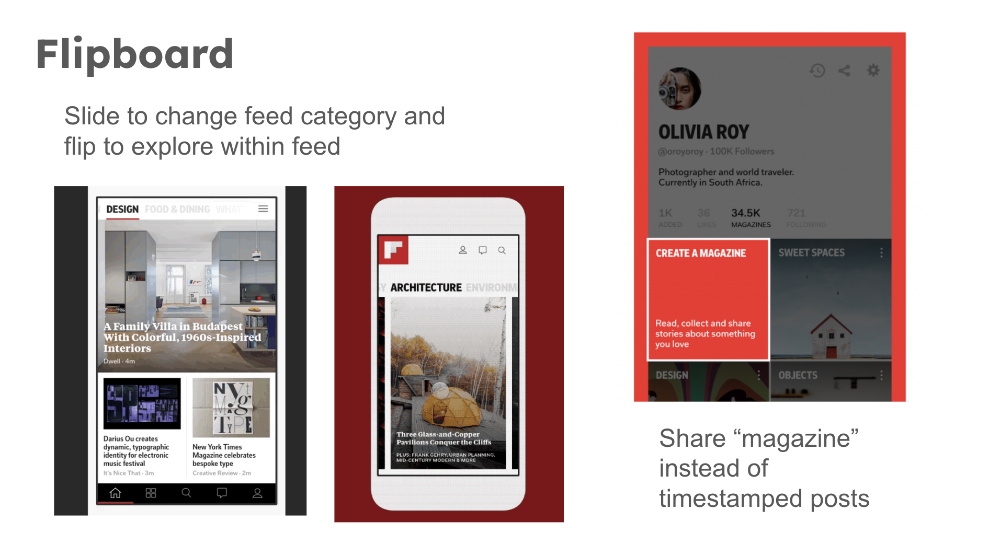

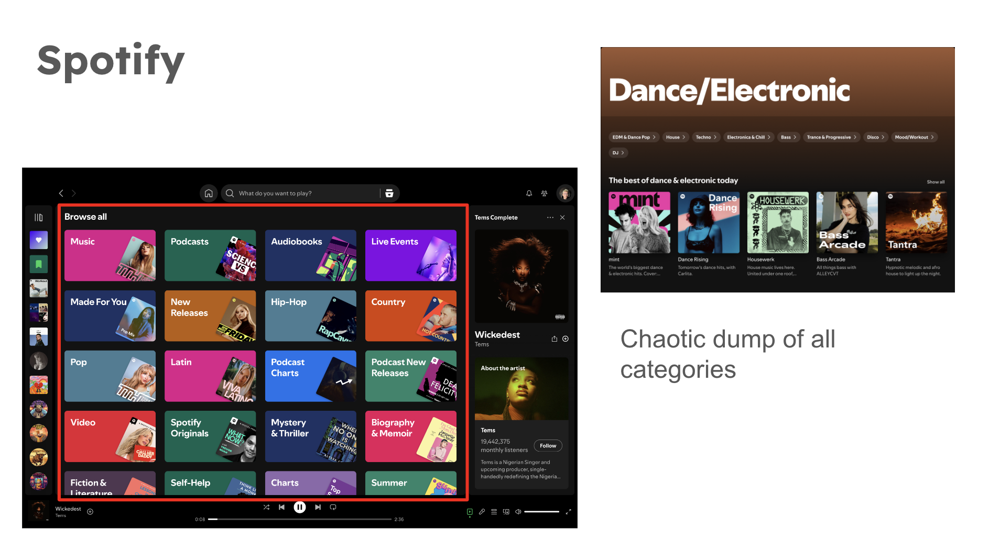

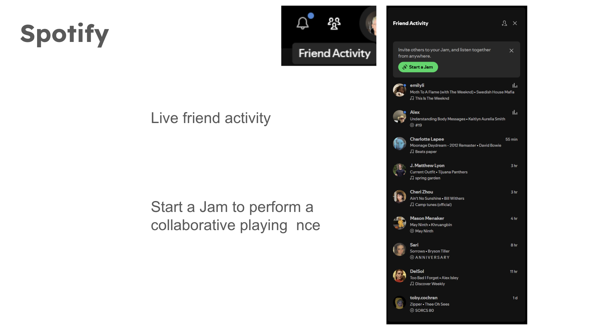

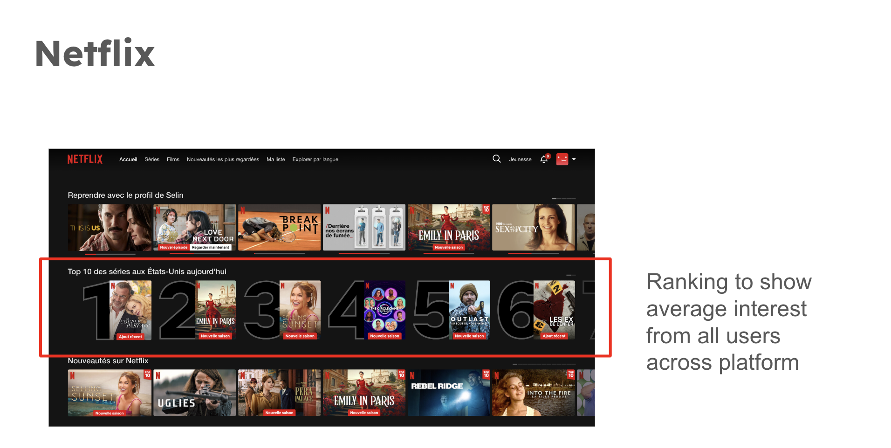

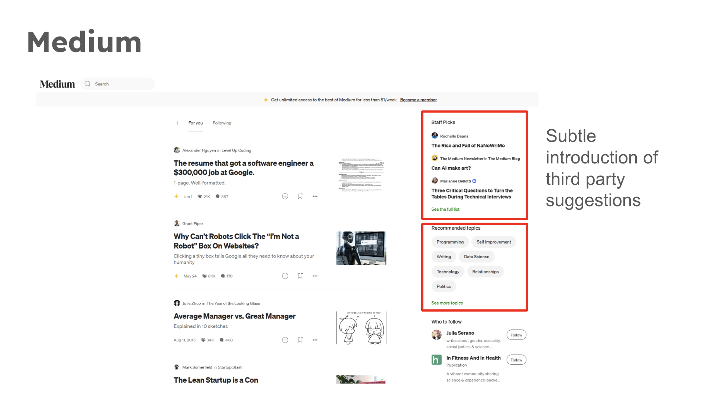

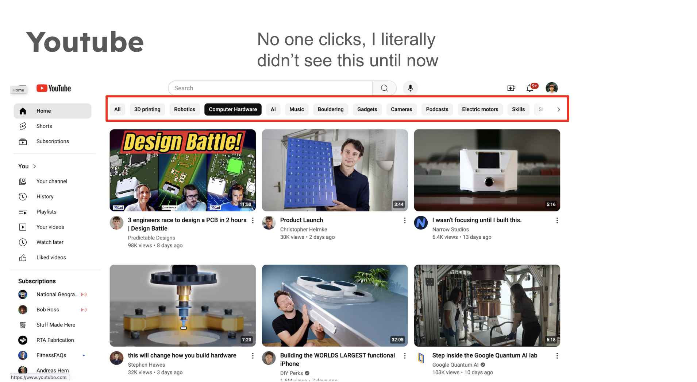

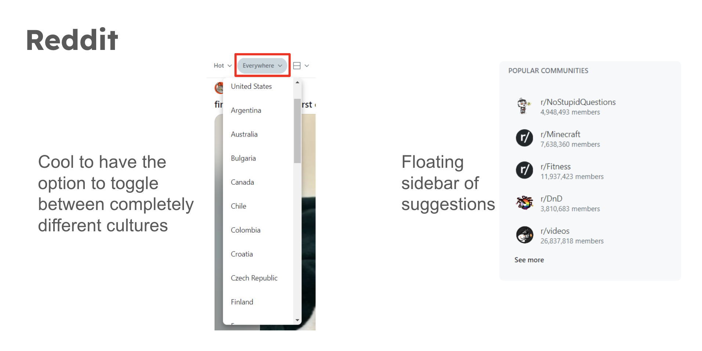

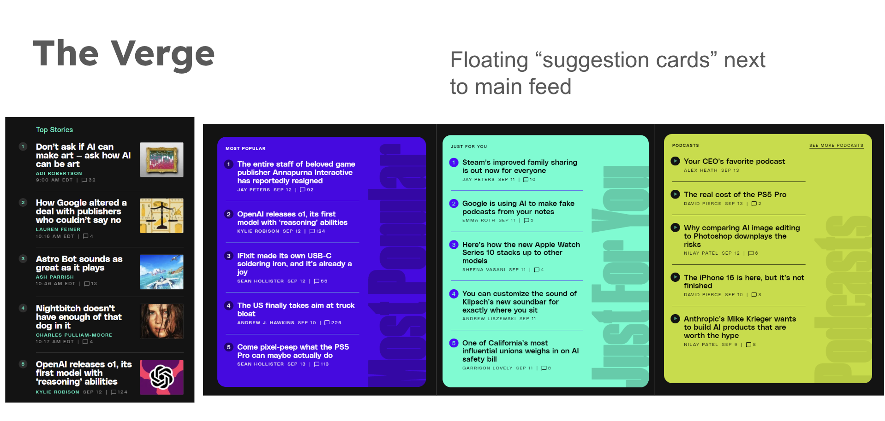

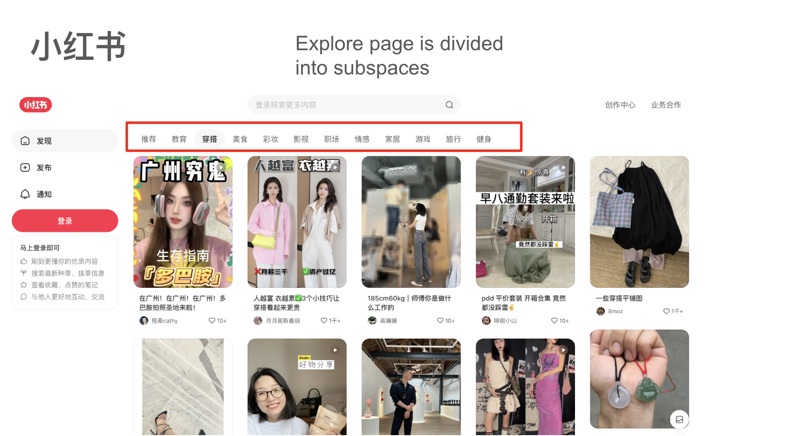

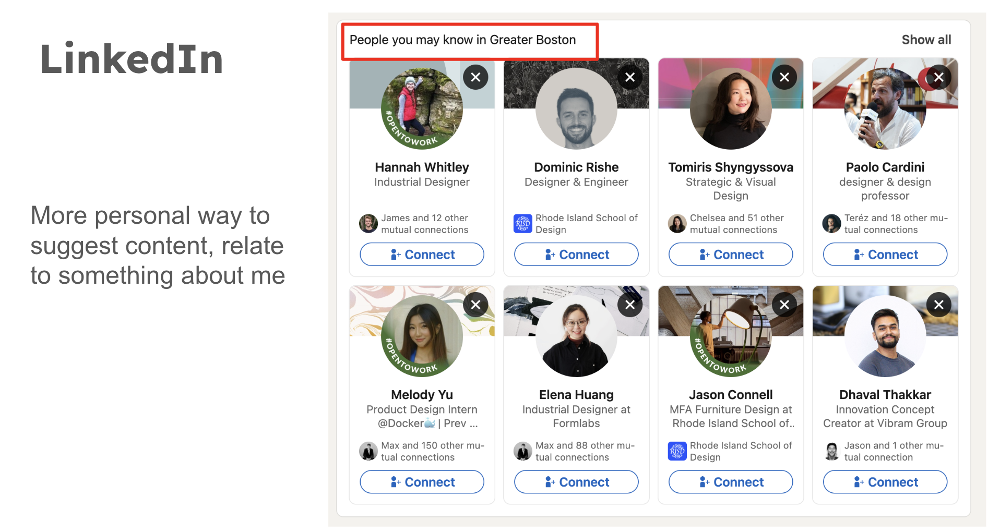

<!--  -->

## 3. Feature Brainstorming (15-20 ideas)

<h4>1. My Moods</h4>

Different content discovery spaces for one individual user.

<h4>2. Sharing Social Glimpses</h4>

Selectively add friend's or influencer's "moods", also share your own curated/trained algorithm.

<h4>3. Browse Jam</h4>

Be lazy but with a friend! Scroll the same feed live with friends.

<h4>4. Algorithm Mixing</h4>

Mix and mash your feed with your friends.

<h4>5. Content Buddy</h4>

Analytics to show who you share similar feeds with.

<h4>6. Suggestion Card</h4>

Each card is a different content category.

<h4>7. Region Hopping</h4>

Change feeds based on location, see what's trending in different parts of the world.

<h4>8. World Average</h4>

See what the average platform user likes.

<h4>9. Polar Identities</h4>

Algorithm creates an opposite feed that contrasts your main feed.

<h4>10. Time-of-day</h4>

Customize on a timeline what contents appear on the feed depending on the time of day.

<h4>11. Shuffle Modes</h4>

Create variants of shuffle with different goals. Random, for me, inspire me, challenge me, surprise me.

<h4>12. My Summary</h4>

Summary on content consumption, good for mindfulness.

<h4>12. Staff Picks</h4>

Space for community moderators to post.

<h4>13. People-inspired Feeds</h4>

Use user profile search to narrow down your feed.

<h4>14. Locally for You</h4>

Personal suggestion notes based on what you like.

## 4. VSD Analysis
**1. Stakeholders** 

- Direct:

- Indirect(non-target):

- Accessibility:

- Children:

**2. Time** 

- Short:

- Mid:

- Long:

**3. Pervasiveness** 

- Widespread use:

- Diverse geographies, multii-national, culture:

- Political realities:

**4. Value** 

- Autonomy:

- Inclusion:

- Community:

- Fairness:

## 5. Storyboarding and sketching

