# Assignment 2: Divergent Design

## 1. Audience and value
**App Name**: Glimpses

**Audience**: Frequent social media users who wish to have more control in how they explore new content and engage with friends.

**Value**: 
- On top of basic sharing features, it focuses on the experience of content discovery.
- Easy tools to break out of algorithm built eco-chambers.
- Make users more balanced, better educated, better informed, and more responsbile for their online habits by giving them the tools to do so.

## 2. Comparables

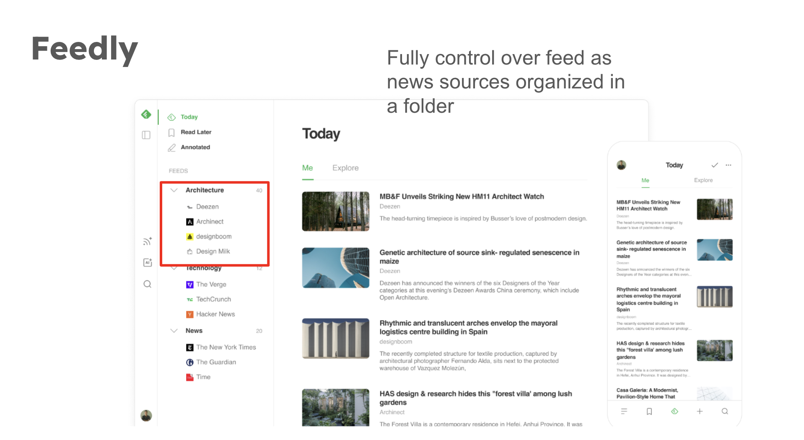

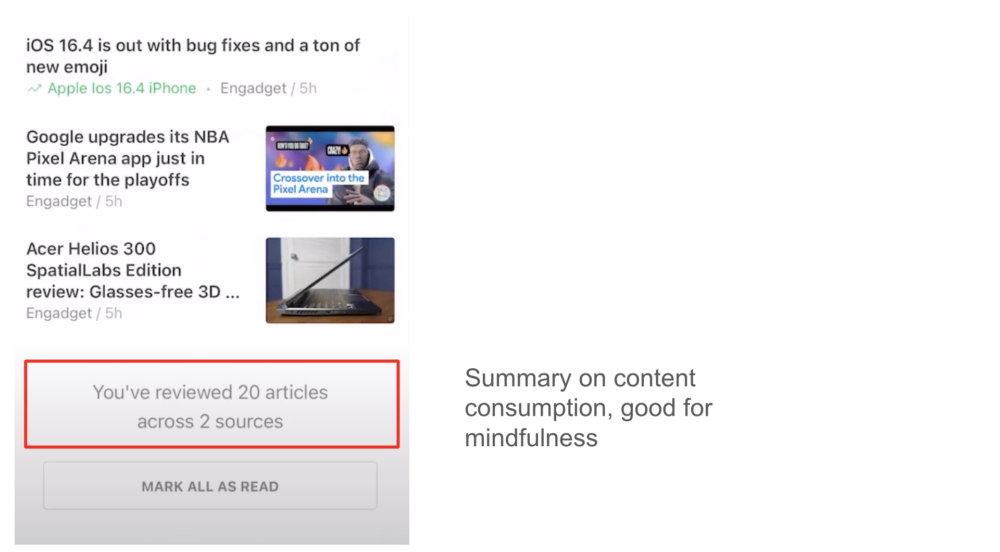

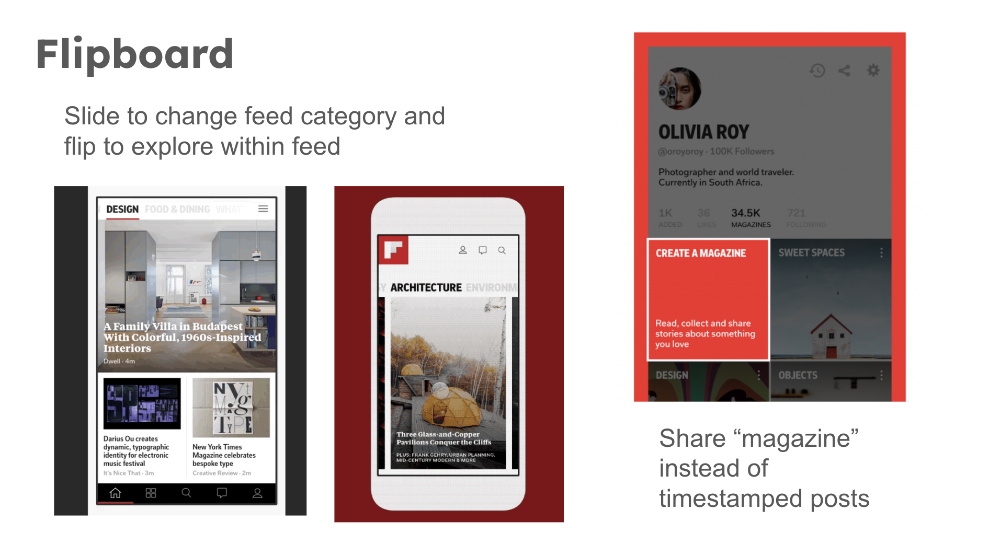

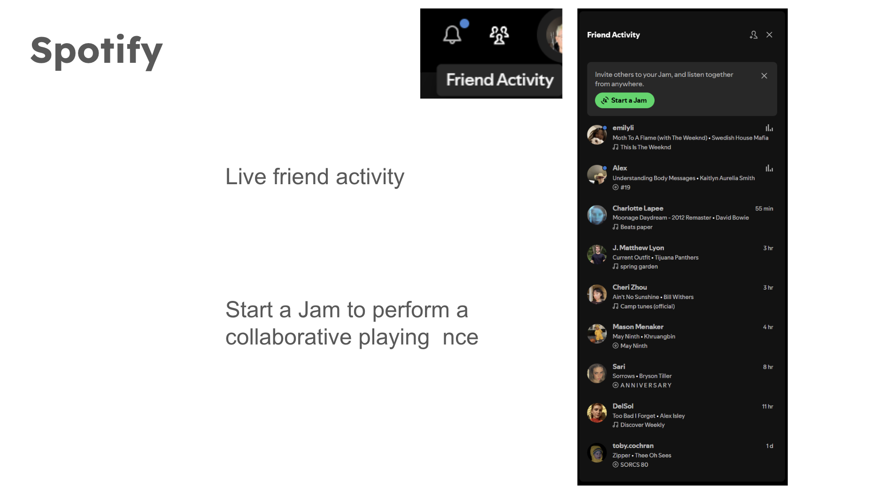

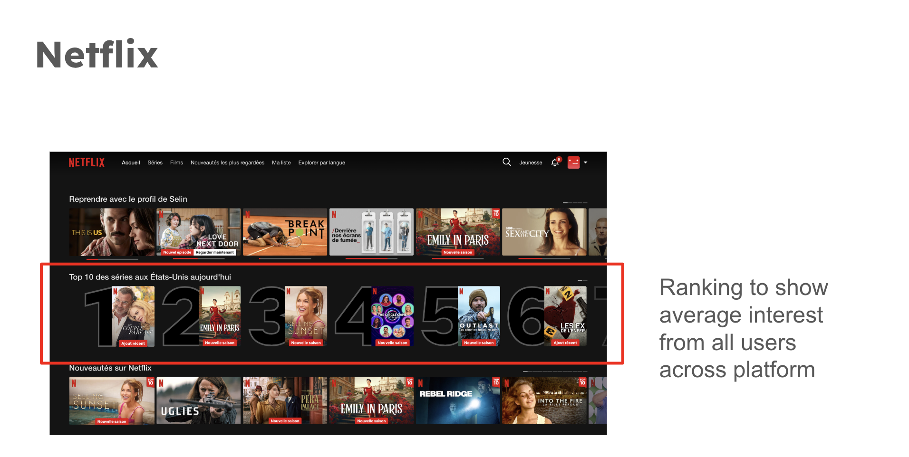

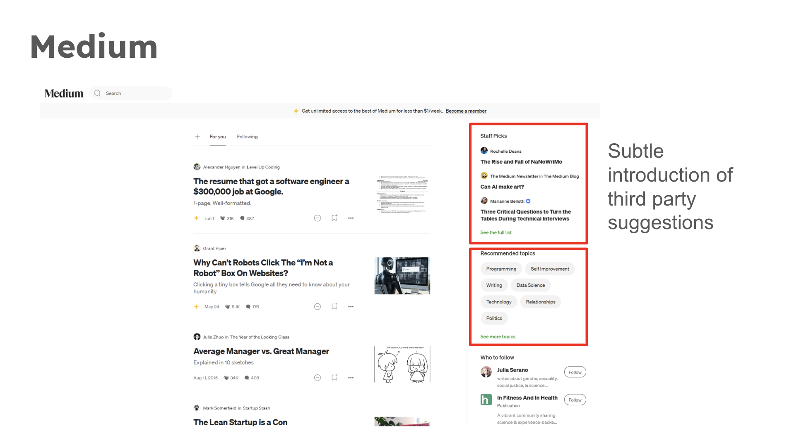

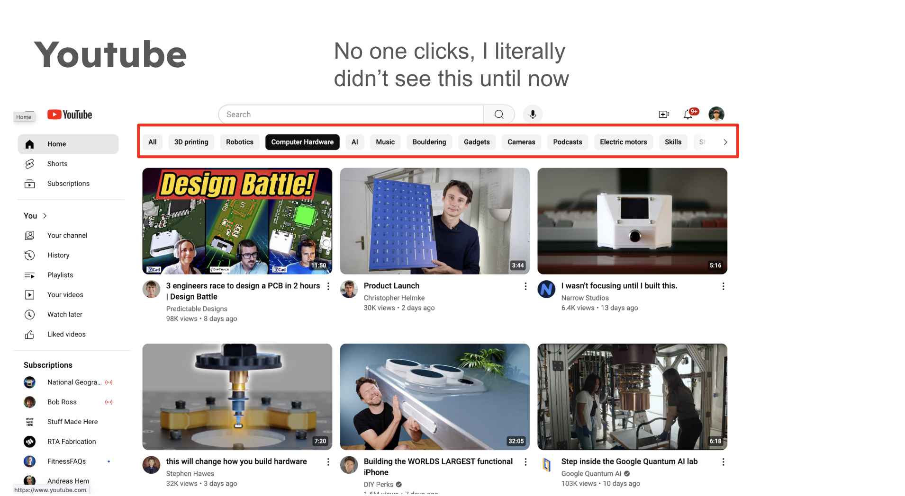

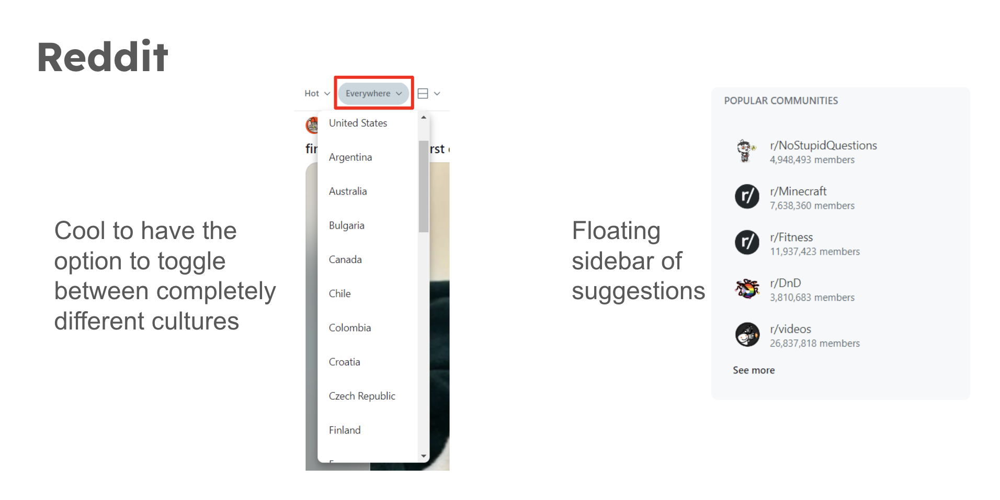

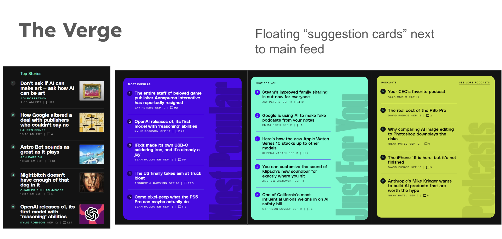

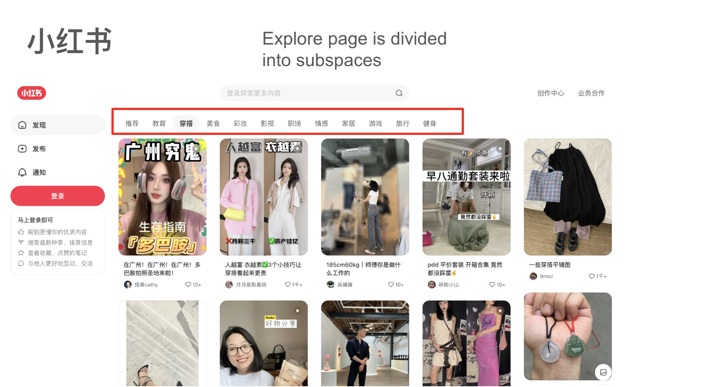

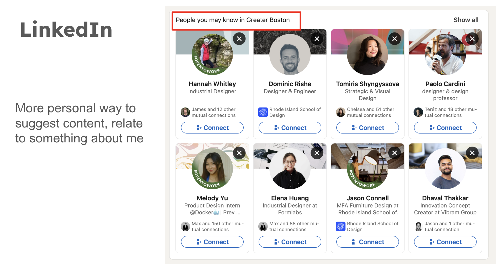

## 3. Feature Brainstorming (15-20 ideas)

<h4>1. My Moods</h4>

Different content discovery spaces for one individual user.

<h4>2. Sharing Social Glimpses</h4>

Selectively add friend's or influencer's "moods", also share your own curated/trained algorithm.

<h4>3. Browse Jam</h4>

Be lazy but with a friend! Scroll the same feed live with friends.

<h4>4. Algorithm Mixing</h4>

Mix and mash your feed with your friends.

<h4>5. Content Buddy</h4>

Analytics to show who you share similar feeds with.

<h4>6. Suggestion Card</h4>

Each card is a different content category.

<h4>7. Region Hopping</h4>

Change feeds based on location, see what's trending in different parts of the world.

<h4>8. World Average</h4>

See what the average platform user likes.

<h4>9. Polar Identities</h4>

Algorithm creates an opposite feed that contrasts your main feed.

<h4>10. Time-of-day</h4>

Customize on a timeline what contents appear on the feed depending on the time of day.

<h4>11. Shuffle Modes</h4>

Create variants of shuffle with different goals. Random, for me, inspire me, challenge me, surprise me.

<h4>12. My Summary</h4>

Summary on content consumption, good for mindfulness.

<h4>12. Staff Picks</h4>

Space for community moderators to post.

<h4>13. People-inspired Feeds</h4>

Use user profile search to narrow down your feed.

<h4>14. Locally for You</h4>

Personal suggestion notes based on what you like.

## 4. VSD Analysis
**1. Stakeholders** 

- Direct: Users will be readily be expose to many opposite view points, which could be uncomfortable or disturbing. This could build distrust towards online content as a whole
    > Observation: When users can swpie and see a "flip-side" to their content, they may feel uneasy or uncomfortable. Depending on the context, they may be triggered by the content.

    > Design response: Implement customizability to how much polar content one wants to see, and how far of a spectrum they want to explore.

- Indirect(non-target): Individuals might use the glimpse feature as a way to online stalk others.
    > Observation: Users might be able to see what content others are looking at, which could be used to stalk or harass others.

    > Design response: Implement strict privacy settings and controls. Users should have the ability to control who can see their glimpse history, and have control over what content they want to share.

- Children: Children interacting might prefer to stay within thier echo chamber/content space, as there is a risk of exposure to content that is not suitable for them.
    > Observation: Exposure to the wrong content could affect a child's social and emotional development.

    > Design response: Implement strict age verification and parental controls.

**2. Time** 

- Short: 
    > Observation: Users discovering new digital spaces and perspectives online could actually level out the playing field of contention in the short term. People could be more empathetic toward one another before telling them they are wrong.

- Long: The availability of new perspectives, opposite views so conviniently available could in the long run cause unexpected shifts in how people deal with opposing views.
    > Observation: In the long run people could become desensitized to opposing views and loss the ability to talke a stand. The opposite could also happen where polarization could be exasterbated in selected individuals due to continuous reinforcement of opposing beliefs.

    > Design response: Implement scheduled check ins or surveys with the user to see how they feel about the content, and adjust content accordingly.

**3. Pervasiveness** 

- Widespread use: As the app grows, more users will be able to curate their own feeds.
    > Observation: The shareability and curatability of feed or algorithm could incentivise a new digital normalcy where people compare their feed to others. This can start a new social behaviour of negative comparison and negative selfworth.

    > Design response: make discovery a private, non-shareable, and non-quantifiable experience.

- Diverse geographies, multii-national, culture:
    > Observation: More diversity in the platform means more diverse searches and exposures to people on a daily bases. This could actually stir up new problem. Problem could arise by informing people of something they didn't know about previously and naturally picking a side to support.

    > Design response: A design choice could be during discovery mode, the polar content suggestor is turned off, so it doesn't allow for immediate comparisons and judgement to form.

- Political realities:
    > Observation: Naturally when delivering political content, it is good to expose people to a more nuanced and multiple sources of information. Given the inherent polarity in politics, the pairing and association between recommended feed and "polar" feed becomes extremely important as the order people take in information can change the storytelling drastically.

    > Design response: Implement community reporting to flag misleading or inapproriate pairings of contradicting posts. Maybe also instead of focusing on delivering opposing content, which in by itself is hostile, milder forms of association and linking to different content could be better.

**4. Value** 

- Autonomy vs Fairness:
    > Observation: Providing full autonomy to users could mean some user groups and their ideologies inundate the rest of the community by sheer posting volume. This could lead to an imbalance in the representation of different viewpoints, potentially drowning out minority opinions or less popular perspectives.

    > Design response: 
1. Implement a balanced content moderation system that ensures different perspectives can co-exist without overwhelming others. This could include:
- Algorithmic balancing to ensure a diversity of viewpoints in users' feeds
- Community-driven moderation to flag and review potentially problematic content
- Limiting the frequency of posts from highly active users to prevent domination

2. Introduce a "diversity score" for user feeds, encouraging users to engage with a range of perspectives.

## 5. Storyboarding and sketching

**Flow 1: Polar Glimpses: Looking for opposite content** 

User argues with friend due to opposite viewpoints. User wants to see beyond their echo chamber. Turns slider to make a bigger step out of echo chamber. Surprises user with different content.
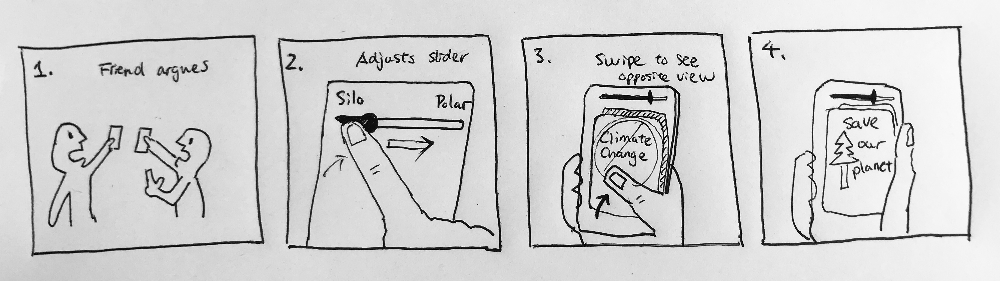

**Flow 2: Social Glimpses: Wondering what content my friends are looking at** 

User sees friend picking up a new hobby. User wonders what other content friends are looking at. Searches friend's profile as a filter for feed.
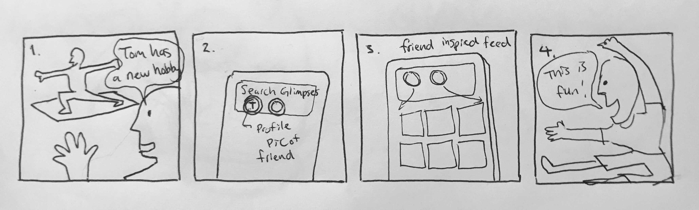

**Flow 3: Feed jamming with friends** 

User and friends want to try out new content discovery spaces. The start a live feed jam session. They can see what each other is looking at and call each other with a "check this out" button.
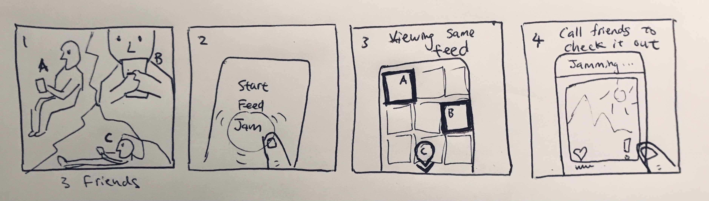