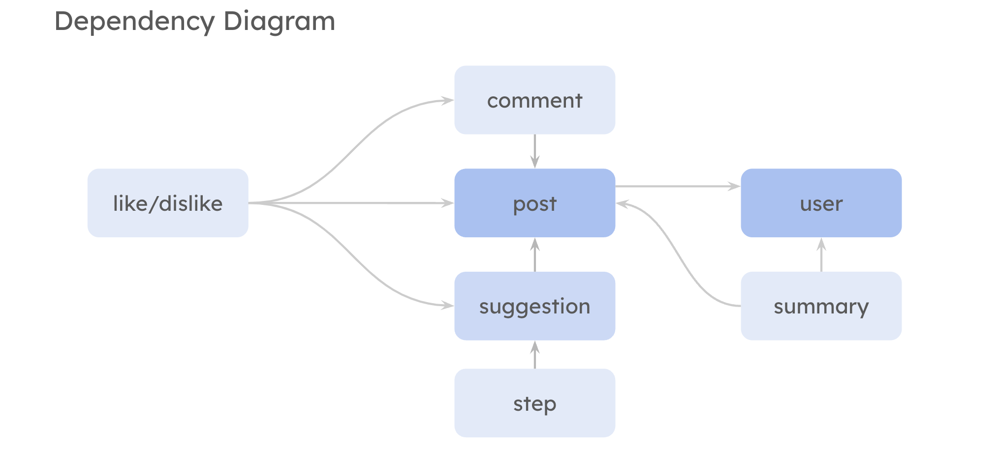

# Assignment 3: Convergent Design

## 1.  Pitch. 
### Wandr: Take a Step Beyond Echo Chambers

Wandr reimagines social media as a journey, where each user is an explorer navigating their consumption habits and discovering beyond their media echo chambers.

Upon signup, users can follow other "Wandrrs" and share a variety of media, including text, photos, short videos, and audio clips, as well as comment on posts.

In the main feed, each post can be *flipped* to reveal alternative viewpoints, encouraging users to broaden their understanding and easily access new content.

Users can customize the "flipped" content behind each *flip* by adjust their *Step*, determining how far each flip will take them within broader content category — whether opting for small, thoughtful steps in a similar direction or bold leaps into new, potentially contrasting territories. 

Additionally, a *summary* feature tracks users' content consumption, providing insights into their behaviors and helping them reflect on their media habits. This encourages mindful engagement and inspires users to seek out fresh ideas.

## 2. Functional design: Concepts

### Concept 1: User

**Purpose**: To give each individual an identity and profile, enabling them to participate in the platform and navigate the app.

**Principle**: 
- Users can create an account and log in/out of the platform. and enage with other users by following and unfollowing them.

**State**:
- User name
- User password
- User profile/bio
- User following
- User followers

**Actions**:
- register
- login/logout
- follow/unfollow
 

### Concept 2: Post

**Purpose**: To allow users to share their media (text, photos, videos, or audio) with the community.

**Principle**: 
- Users share media (text, photos, videos, or audio) visible to the whole community.

**State**:
- Post media
- Post date
- Post author
- Post category
- Post semantics

**Actions**:
- Create
- Edit
- Delete

### Concept 3: Comment

**Purpose**: To foster meaningful conversations and interactions on posts shared by other users.

**Principle**: 
Users provide thoughts, reaction, feedback, ask questions, or engage with posts and other comments in a threaded format by typing them in a comment box and submitting.

**State**:
- Comment text
- Replies

**Actions**:
- Comment
- Reply
- Delete
- Edit
- No Comment

### Concept 4: Suggestion

**Purpose**: To reveal alternative viewpoints or contrasting perspectives on a post in the form of suggested posts, enriching the user’s journey through diverse content.

**Principle**: 
- Users can view suggested content that relateds to the theme of the original post but differes in focus, perspective, or medium.

**State**:
- Suggestion target
- Suggestion List

**Actions**:
- Suggest [Target]
- Like Suggestion
- Generate Another

### Concept 5: Step

**Purpose**: To let users control the extent of exploration and discovery in the content they interact with, personalizing the depth of their journey.

**Principle**: Users adjust the level of dissimilarity they want to explore in relation to the original post.

**State**:
- Step value
- Step range

**Actions**:
- Set step
- Update step

**Actions**:
- Calculate Summary
- Display Summary

### Concept 6: Like/Dislike

**Purpose**: To allow users to express their preferences and provide feedback on the content they consume.

**Principle**: Users can like or dislike a target, providing feedback on if they like or dislike the target. **This doesn't necessary mean upvoting or downvoting, but to keep track of their viewing habits and acceptability.**

**State**:
- Like/dislike target
- Like/dislike list

**Actions**:
- Like [Target]
- Dislike [Target]

### Concept 7: Summary

**Purpose**: To provide users with insights into their content consumption habits and behaviors, helping them reflect and be mindful of their media consumption.

**Principle**: Tracks users' content consumption based on the types of media they consume and the frequency under each category  and provides representation of data.

**State**:
- Total content consumed
- Total time spent
- New content liked
- New content disliked
- content consumed per category
- content consumed per perspective

**Actions**:
- Calculate Summary
- Display Summary

## 3. Dependency Diagram. 

## 4. Wireframes. 
<!-- Construct a set of wireframes that shows the user interface elements and their layout, and includes some of the main flows. You can omit error handling and completely standard interactions (such as user registration), but your wireframes should otherwise be enough to cover all your concepts. -->

## 5. Design tradeoffs. 
<!-- Using the notes that you took during your design, pick at least 3 design decisions that you made in which you had to choose between multiple options. For each one, provide (a) a pithy title naming the issue; (b) an outline of what the various options were; (c) a rationale for why you chose one option over the others. Try to keep your analysis below 300 words in total (for all the tradeoffs). -->

### Tradeoff 1: 
- **Options**:

- **Rationale**:    

### Tradeoff 2: 
- **Options**:

- **Rationale**:

### Tradeoff 3: 
- **Options**:

- **Rationale**:    

