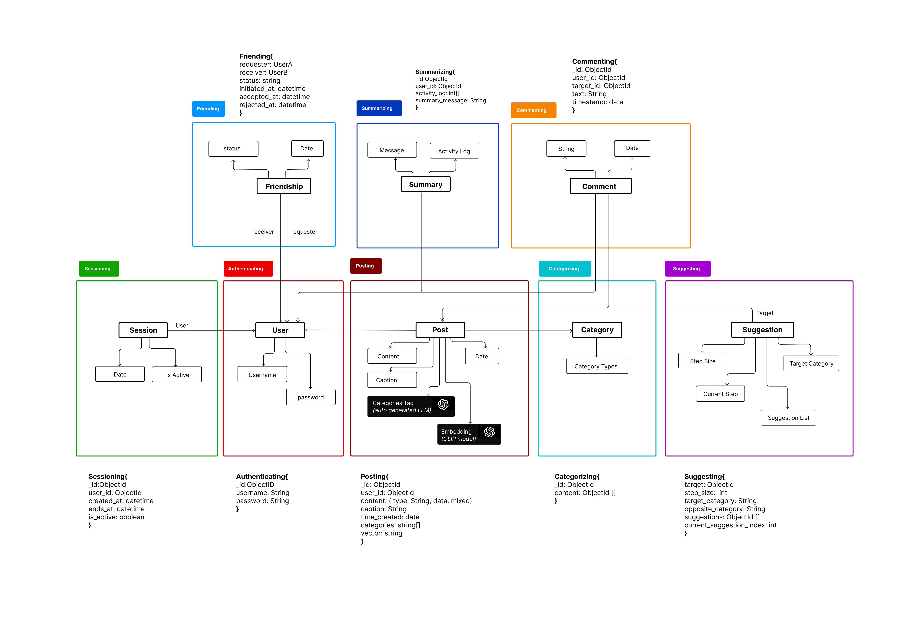

# Assignment 4: Backend Design & Implementation

## 1.  Abstract Data Model. 

## 2.  Working in Progress Code 
[Github Repo](https://github.com/kvntang/wandr_backend).

## 3.  Deployed Vercel Site 
[Vercel Site](https://wandr-980qy5hn9-kvntangs-projects.vercel.app/).