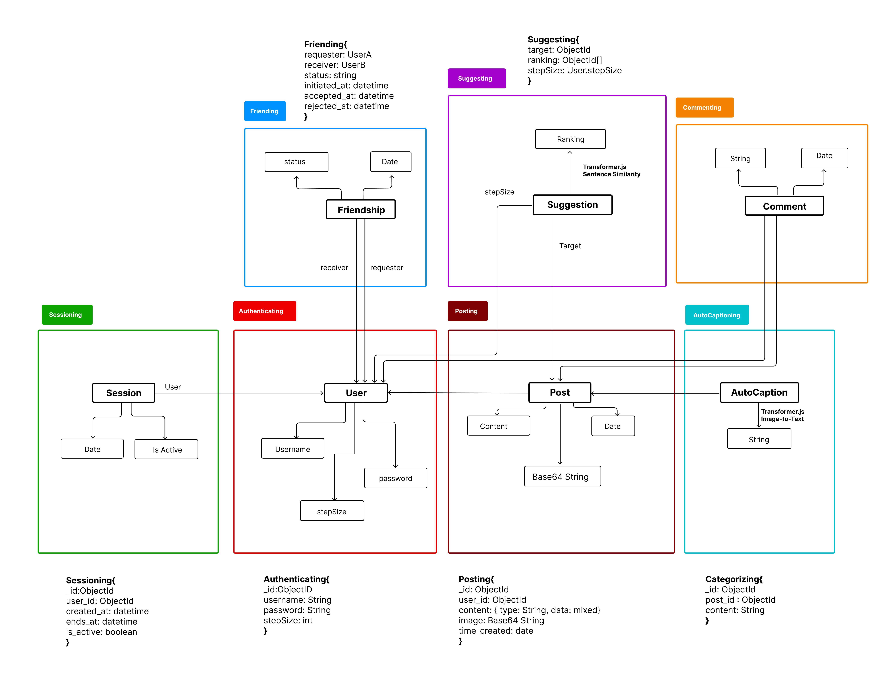

# Assignment 4: Backend Design & Implementation

## 1.  Abstract Data Model (inital). 

## 2.  Working in Progress Code 
[Github Repo](https://github.com/kvntang/wandr_backend).

## 3.  Deployed Vercel Site 
[wandr-pi.vercel.app/](https://wandr-pi.vercel.app/).

## 4.  Design Reflection

# Updated Data Model (final)

During the development of my backend service, my initial plan of creating a tagging system for post suggestion evolved significantly. At first, I intended to use OpenAI iamge embeddings and categorization for tags, but I soon realized that relying on user input for tags could be tedious and would compromise the user experience. Additionally, modularizing this concept and integrating it with multiple APIs proved to be more complex than expected.

To address these challenges, I incorporated two models from the Hugging Face API, which greatly enhanced my suggestion concept based on adjustable *step size*. First, I implemented an *image-to-text* model to automatically generate captions for every post’s image content. These captions are stored separately in MongoDB, linked to their respective posts. This approach keeps the captions isolated for use in the suggestion algorithm.

Second, I used a *sentence similarity* model, which compares the auto-caption of a target post to the captions of other posts, returning similarity scores. This allowed me to rank posts by similarity and, combined with the step size concept, gave users control over how similar or diverse the suggested content would be.

One of the significant challenges I faced was integrating the Hugging Face models into a scalable backend architecture, especially into the concepts. Since the concepts handle functions that modify MongoDB, I wasn’t sure where to place the external API calls, as they felt foreign to the typical database interaction logic. Additionally since the suggestion concept doesn't store anything to MongoDB, I was unsure what to put in the concpet file and ended up implementing everything within routes.ts.

The suggestion algorithm works well for its intended purpose, but there is room for optimization. Future improvements could include refining the model selection, adding contextual data, and allowing users to give feedback on suggestions to improve relevance.

This process taught me a lot about modularizing backend services and leveraging third-party APIs for content generation and suggestion algorithms. 