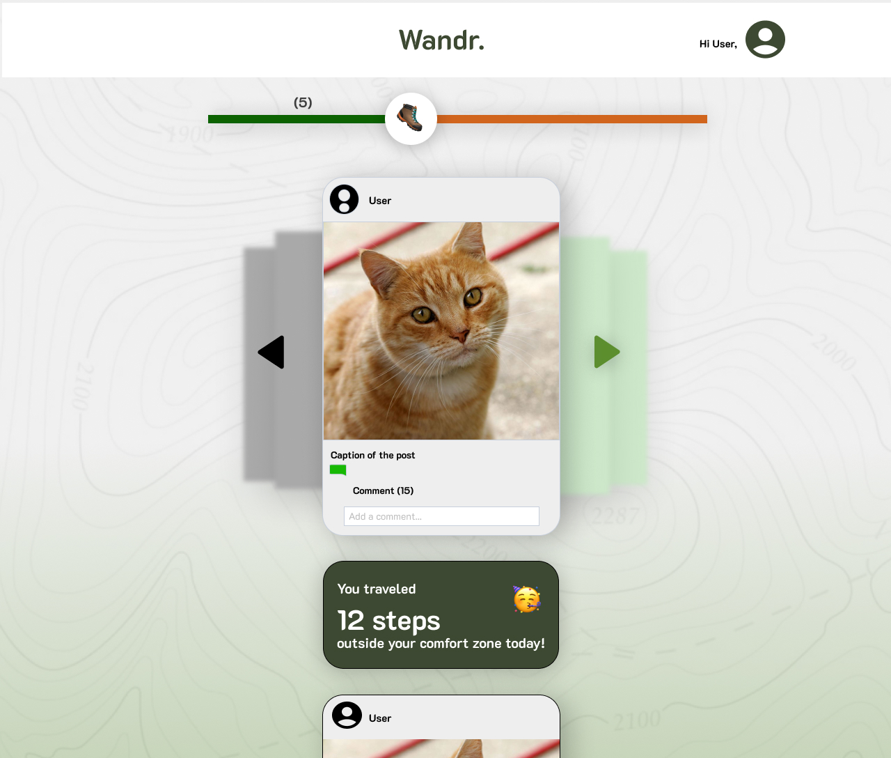
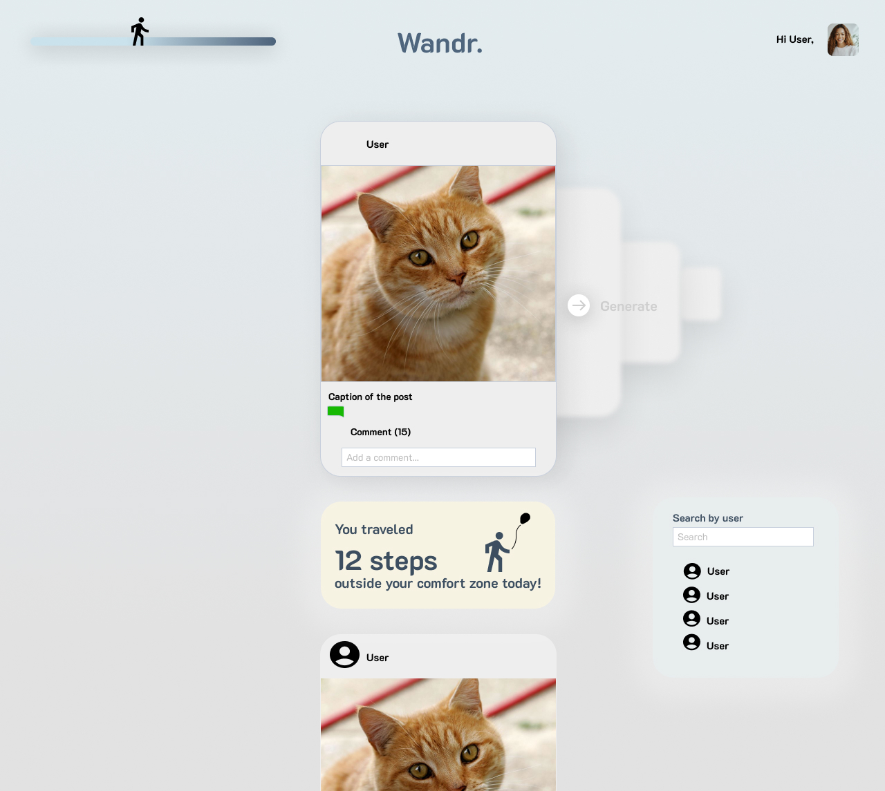

# Assignment 5: Backend Design & Implementation

## 1.  Heuristic Evaluation. 
### Usability criteria: capture the broad overall goals that your visual and interactive designs might be trying to satisfy

*Discoverability*: how rapidly and easily can users understand how to operate the interface?
Does the user know that swiping horizontally means stepping?
Does the user know the step button is a button and not a logo?

*Safety*: how does the interface guard against people making mistakes? 
how does the interface from protecting users from “stepping” to far into opposite view points? should there be a warning saying what you might see next might be out of your comfort zone, approach with caution/open-mind?
the app by nature challenges echo-chambers, but it could also lead to unnecessary online conflicts/comment wars

### Physical heuristics: describe characteristics about the user interface that affect how users might operate it

*Mapping*: does the layout of the interface elements match their function?
Can the stepping and journey progress bar be better represented?

*Situational context*: how does the interface convey to a user their context (where they are, the app’s state, etc.), and how does it adapt to their context?
The journey progress bar is a sort of visualizing how deep the user has gone in a discovery streak. The current design allows the user to not only use the progress bar to track but also to reset the target of the feed. This might be unnecessary.

### Linguistic level: describe cultural conventions and norms about the interface

*Speak a user’s language*: does the interface use simple, helpful informative messages? are there instances where messages might only be understandable by developers?
In a way, the step is a metaphor. the graphics or the interaction can be designed to emphasize this.

*Consistency*: does the interface reuse the same names, symbols, and icons for the same concepts or actions? how consistent is the interface with others across the same application domain or platform?
Does the horizontal journey progress bar communicate how far in total or per target?
Does the logo have to stay there?
Can the logo be step setting?

## 2.  Visual Design Study

## 3.  Working in Progress Code 
[Github Repo](https://github.com/kvntang/wandr_fullstack).

## 4.  Deployed Vercel Site 
[wandr-pi.vercel.app/](https://wandr-fullstack.vercel.app/).

